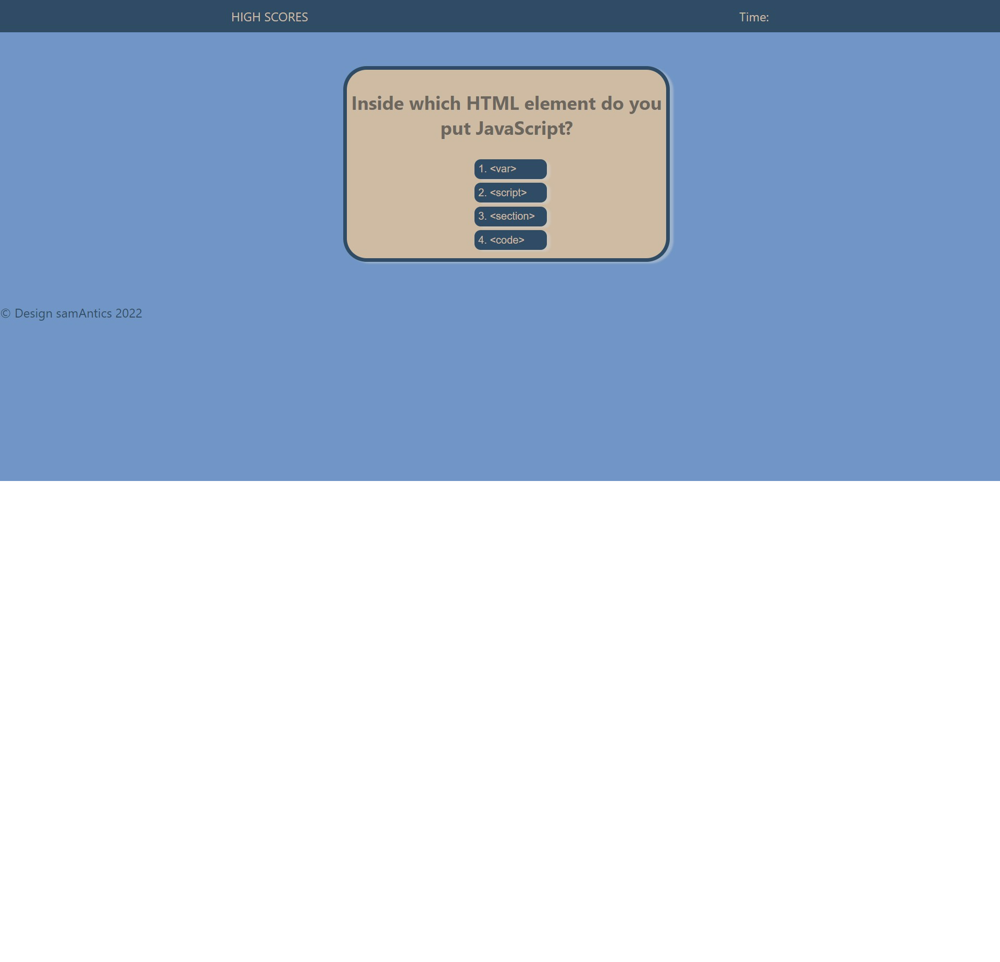

# quiz-game
### Week 4 Challenge
## Project Description
Create a timed quiz game which presents multiple choice questions. When a question is answered incorrectly, time should be deducted from the clock. When the game is over, initials should be requsted so that high scores can be saved and cataloged.
### User Story
```
AS A coding boot camp student
I WANT to take a timed quiz on JavaScript fundamentals that stores high scores
SO THAT I can gauge my progress compared to my peers
```
### Acceptance Criteria
```
GIVEN I am taking a code quiz
WHEN I click the start button
THEN a timer starts and I am presented with a question
WHEN I answer a question
THEN I am presented with another question
WHEN I answer a question incorrectly
THEN time is subtracted from the clock
WHEN all questions are answered or the timer reaches 0
THEN the game is over
WHEN the game is over
THEN I can save my initials and score
```

## Deployed Website
https://sam-antics.github.io/quiz-game/



## Built With
* HTML
* CSS
* JavaScript


## Author
**Samantha Guerra**

- [GitHub Profile](https://github.com/Sam-Antics)
- [LinkedIn](https://www.linkedin.com/in/seguerra/)
